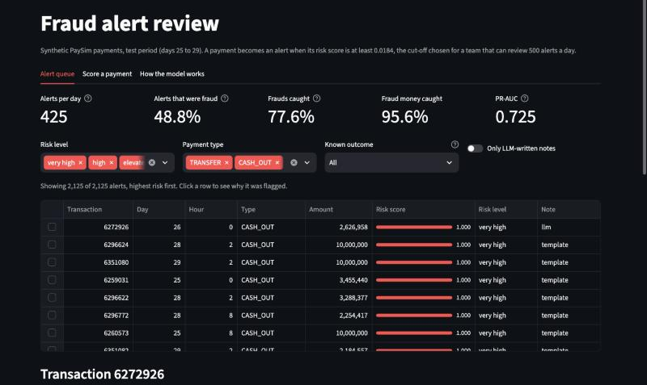
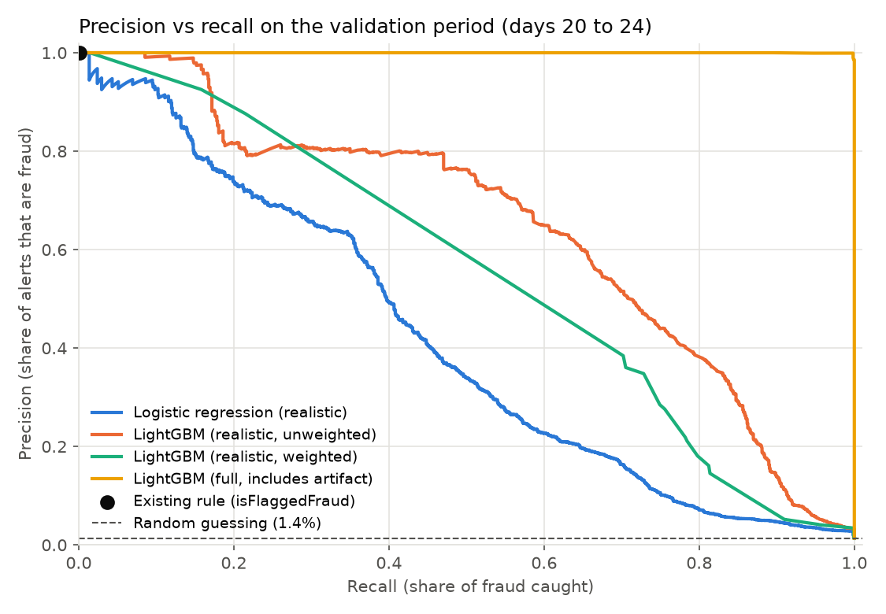
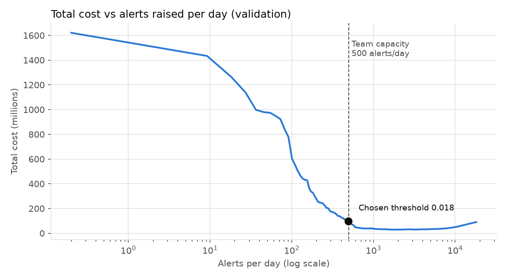
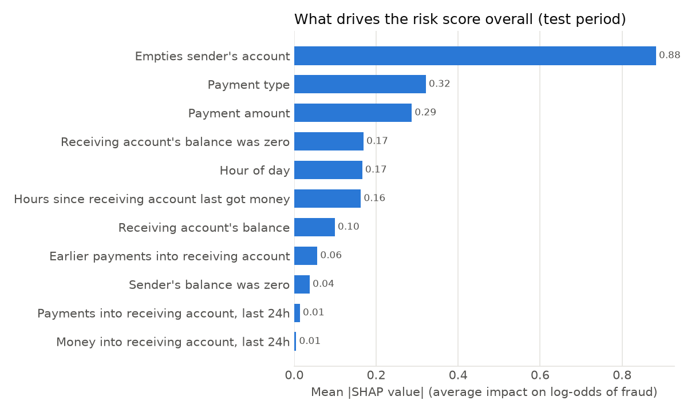
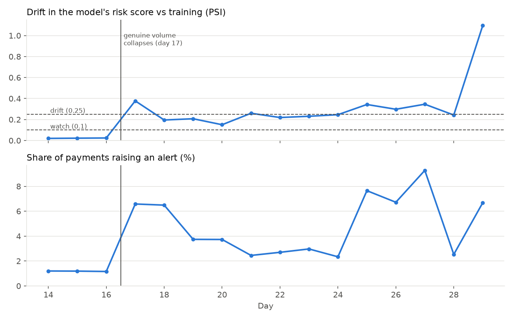

# Payment fraud detection with explainable alerts

[](https://github.com/Om-Ravindra-Patil/fraud-detection/actions/workflows/ci.yml)

A fraud detection system for mobile money payments, built the way a bank's economic crime team
would need it: scores that are tested on future data, an alert threshold chosen from business
costs and analyst capacity, a reason for every alert, and a check on who gets wrongly flagged.



## The problem

A fraud team cannot review every payment. The model has to rank payments by risk so that a
limited number of analysts spend their time on the right ones. Two kinds of mistake cost money:
a missed fraud loses the stolen amount, and a false alert costs analyst time and holds up a
genuine customer's payment. This project builds the model, chooses where to draw the alert line
using those costs, and explains each alert in plain English for the analyst who picks it up.

## Data

[PaySim](https://www.kaggle.com/datasets/ealaxi/paysim1) (licence CC BY-SA 4.0) is a synthetic
dataset generated from a month of logs from a real mobile money service. It has 6,362,620
transactions over 744 hourly steps, of which 8,213 (0.13%) are fraud. No real customer data is
used anywhere in this project.

All fraud in PaySim is in TRANSFER and CASH_OUT payments, so the model is trained on those
2,770,409 transactions.

**A simulator artifact, found and removed.** In 8,018 of the 8,213 frauds, the payment is exactly
equal to the sender's full balance. Not one of the 2.76 million genuine payments does this. It is a
rule inside the simulator, and it is why most PaySim projects report near-perfect scores. With
the exact balance included, LightGBM reaches a PR-AUC of 0.9999. The main model leaves it out and
keeps a looser, realistic flag ("the payment empties the account"), which is fraud only 0.68% of
the time. The post-payment balance columns are dropped entirely, because a bank scoring a
payment before approving it would not have them.

## Approach

1. **SQL feature engineering in DuckDB** ([sql/](sql/)). Loading, cleaning and all features are
   SQL. Account history features use window functions over strictly earlier hours only, so no
   feature can see the future. Tests check this by adding a future transaction and confirming
   that no earlier feature changes.
2. **Time-based split.** Train on days 0 to 19, choose the threshold on days 20 to 24, test once
   on days 25 to 29. Day 30 is dropped: its 282 payments are all fraud, another simulator quirk.
3. **Models.** Logistic regression (with balanced class weights) as the baseline against
   LightGBM. Every run is logged to MLflow.
4. **Class imbalance.** Weighting fraud cases up made LightGBM worse (validation PR-AUC fell from
   0.642 to between 0.42 and 0.49), so the main model is unweighted. Imbalance is handled by
   judging models on PR-AUC, precision and recall rather than accuracy, and by choosing the
   threshold from costs.
5. **Cost-based threshold.** Total cost is the money lost to missed fraud plus a review cost for
   every alert, with the fraud team limited to 500 alerts a day.
   See [docs/threshold_decision.md](docs/threshold_decision.md).
6. **Explanations and fairness.** SHAP reasons for every alert, and false alert rates compared
   across payment type, time of day and amount. See [docs/responsible_ai.md](docs/responsible_ai.md).
7. **Analyst notes.** A local LLM turns each alert's SHAP reasons into a short note.
8. **Dashboard.** A Streamlit app to review alerts, score new payments live and watch drift.
9. **MLOps.** MLflow tracking, Docker, GitHub Actions and PSI drift monitoring.

## Results

### Comparing models on the validation period (days 20 to 24)

| Model | Features | PR-AUC |
|---|---|---|
| Logistic regression | Realistic | 0.416 |
| **LightGBM** | **Realistic** | **0.642** |
| LightGBM | Full, includes the simulator artifact | 0.9999 |

A model that guessed at random would score 0.014 here, the fraud rate in this period.



### Choosing the threshold

On cost alone, the cheapest threshold raised about 1,670 alerts a day. A typical missed fraud costs
around 470,000 (the median), far more than a review, so the cost calculation favours catching
nearly everything. No team can review that many alerts, so the threshold is the cheapest one
that keeps alerts within 500 a day: a risk score of **0.0184**. That choice stays the same for
any review cost between 100 and 20,000 per alert, so it does not depend on a guessed cost
figure.



### Final test result (days 25 to 29, scored once with every setting frozen)

| | LightGBM | Logistic regression | Existing rule |
|---|---|---|---|
| Alerts per day | 425 | 384 | 1 |
| Precision (alerts that were fraud) | **48.8%** | 37.7% | 100% |
| Recall (frauds caught) | **77.6%** | 54.2% | 0.4% |
| Fraud money caught | **95.6%** | 65.8% | 0.9% |
| PR-AUC | **0.725** | 0.509 | n/a |

About one alert in two is real fraud. The model catches 78% of fraud cases and 96% of the money,
because the frauds it misses are mostly small ones. Total cost (missed fraud plus review time) is
95.5% lower than raising no alerts, and 87% lower than the logistic regression baseline at a
similar alert volume. PaySim's own rule (`isFlaggedFraud`) is never wrong but catches 5 of 1,336
frauds.

## What drives the score



The strongest signals are whether the payment empties the sender's account, the payment type,
the amount, and whether the receiving account was empty beforehand. For each alert, the top five
reasons are shown as sentences such as "Payment empties the sender's account" or "First payment
ever seen into this receiving account".

## Who gets wrongly flagged

PaySim has no protected characteristics, so the fairness check compares false alert rates across
segments that can stand in for protected groups in real data.

**Genuine payments made at night are wrongly flagged 19.0% of the time, against 2.4% during the
day.** Fraud in PaySim happens around the clock while genuine activity almost stops at night, so
the model learns that night means risk. At a real bank this would mostly hit night-shift workers.
On validation, removing the hour feature brought the night-time rate down from 16.4% to 2.1%,
at a cost of 7 points of recall, while catching the same share of fraud money (94%). The write-up
recommends dropping the feature before any real use. The reported model keeps it, because the
test period had already been scored when this was found.

The same document covers data minimisation, UK GDPR (including Article 22 and keeping a human
in the loop), the FCA Consumer Duty and what to monitor in production.

## Analyst notes from a local LLM

Notes are written by Llama 3.2 3B running locally through Ollama, so no data leaves the machine
and there is no API cost. The prompt contains only the risk score, payment type, amount and
SHAP reasons, never account or transaction IDs (a unit test checks this). Notes are generated
once in a batch and saved, so the dashboard never calls the LLM.

Every note is checked before it is kept. A note is rejected and replaced with a template note if
it contains a number that is not in the facts, guesses at the type of fraud, or runs too long.
Of 200 notes spread across the alert queue, 197 passed and 3 were rejected for guessing "scam".

Example, for a borderline alert (score 0.067, actually genuine):

> This payment is moderately risky due to the receiving account holding no money before the
> payment. The payment is also a transfer, which raises concerns. A practical check would be to
> verify the sender's account balance before this payment to confirm it was not empty.

## MLOps and monitoring

- **Experiment tracking.** Every training run, threshold choice and test score is logged to MLflow
  with its parameters, metrics and model file (`make mlflow`).
- **Tests and CI.** 62 pytest tests run on every push through GitHub Actions. They cover feature
  leakage, split ordering, the cost and threshold logic, the note guardrails, drift maths, and a
  check that the dashboard's Python features match the SQL features exactly (training/serving
  skew). A second job builds the Docker image, starts it and checks the dashboard responds.
- **Docker.** The dashboard image holds only what it needs: the code, the exported LightGBM model,
  the frozen threshold and a 250 KB data bundle. It has no training stack, and per-alert
  explanations come from LightGBM's built-in TreeSHAP rather than the `shap` package.
- **Drift monitoring.** A reference profile of the training data is saved with the model
  (`models/reference_profile.json`), and later data is compared with it using the Population
  Stability Index (PSI), the usual drift measure in bank model monitoring.



PaySim has a real shift built in: genuine payment volume collapses on day 17 while fraud carries
on. The monitoring catches it on the first day, from the model's output alone. The risk score's
PSI jumps from 0.024 to 0.378 and the alert rate goes from 1.2% to 6.6%, before any fraud
outcomes would be known. The drifting inputs are the receiving-account history features (PSI
around 3), while the payment itself (amount, type, balances) stays stable. History features also
drift a little within the training period, because no account has any history on day 0, so a
real deployment would need a warm-up period before its baseline is taken.

## Limitations

- **Synthetic data.** PaySim is simulated, and some of what the model learns (the night-time
  pattern, the exact-balance rule) comes from how the simulator works rather than how fraud works.
- **The test period has far more fraud than a real bank.** Genuine activity drops sharply late
  in the simulation, so 3.1% of test payments are fraud. At a real fraud rate, the same threshold
  would give lower precision.
- **Costs are assumptions** in PaySim's unnamed currency, and missed fraud is assumed to be
  unrecoverable. Both are settings in [configs/config.yaml](configs/config.yaml).
- **The notes come from a small model.** The suggested checks are often generic. The provider is
  a config setting, so a larger model can be swapped in.

## Project structure

| Path | Contents |
|---|---|
| `sql/` | Data loading, cleaning, features and EDA queries, all in SQL |
| `src/fraud/` | Pipeline code: split, training, threshold, SHAP, fairness, notes, serving |
| `app/` | Streamlit dashboard and the small data bundle it reads |
| `models/` | Exported LightGBM model and the frozen alert threshold |
| `docs/` | Threshold decision and responsible AI write-ups |
| `reports/` | Result tables and charts |
| `tests/` | 62 pytest tests, including leakage, training/serving skew, drift and dashboard tests |
| `Dockerfile` | Dashboard image, built and smoke-tested in CI |
| `.github/workflows/` | GitHub Actions: lint, tests and Docker build on every push |

## Run it yourself

The dashboard runs straight from a clone, with no data download:

```bash
make setup
make app        # http://localhost:8501
```

Or with Docker:

```bash
docker build -t fraud-dashboard .
docker run -p 8501:8501 fraud-dashboard
```

To rebuild everything from the raw data (needs a Kaggle login and, for the notes, Ollama):

```bash
.venv/bin/kaggle auth login
make data features eda      # download PaySim, build features in DuckDB, run the SQL EDA
make train evaluate         # train and compare models, choose the threshold, score the test period
make explain fairness       # SHAP explanations and the false alert check
make notes drift            # LLM analyst notes and the PSI drift report
make app-data               # export the model and build the dashboard bundle
make test                   # 62 tests on small synthetic data
make mlflow                 # experiment tracking UI at http://127.0.0.1:5001
```

For the notes: `brew install ollama && brew services start ollama && ollama pull llama3.2:3b`.

## Still to come

Deployment of the dashboard on AWS.
